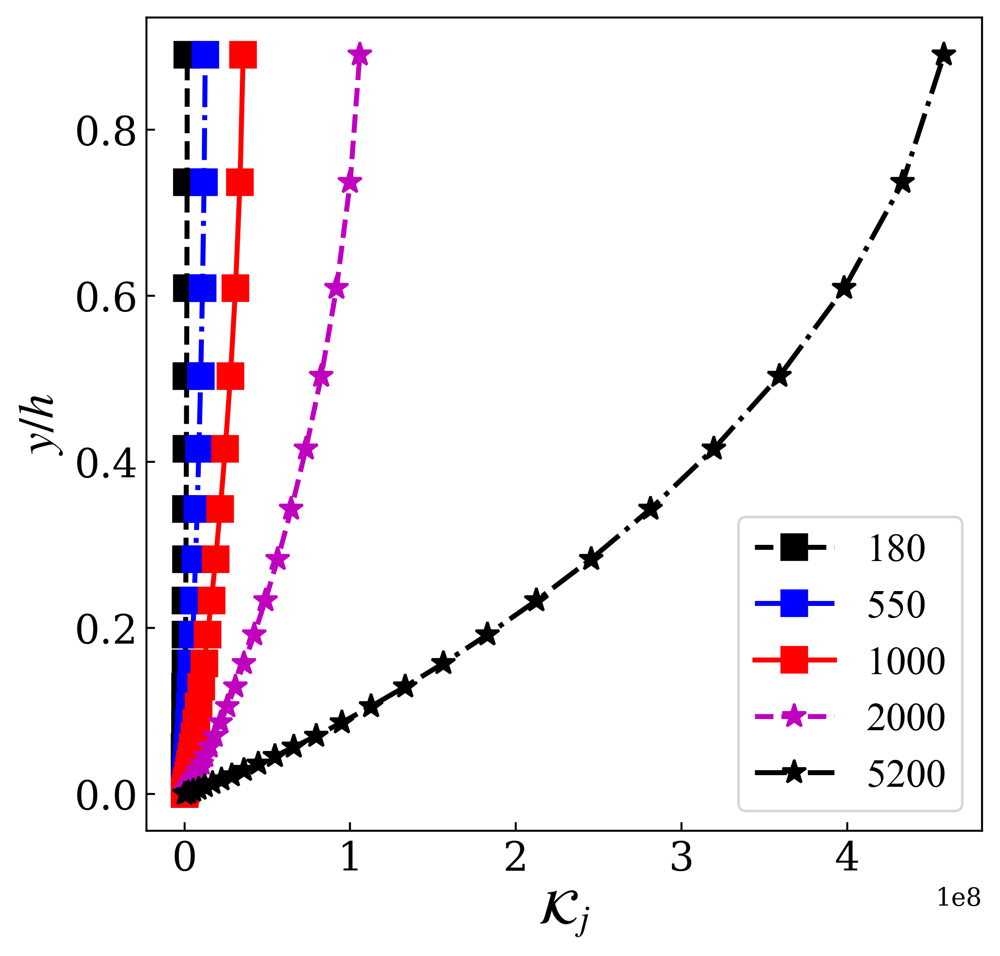
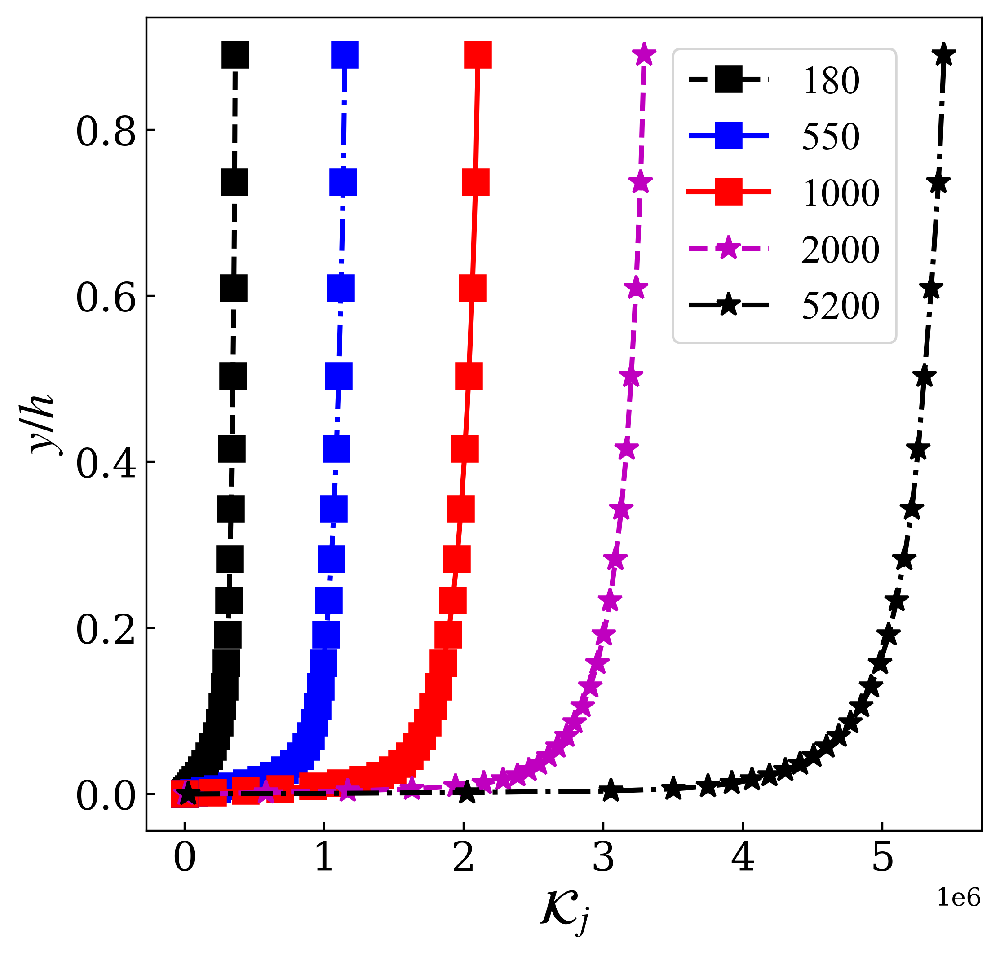
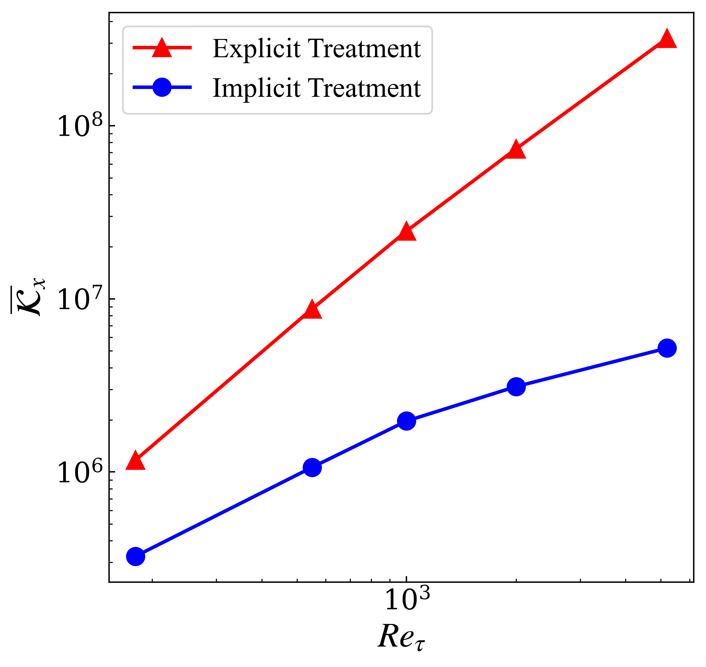

# Local Condition Number

**Note**

*  This repository is to access coeff matrix and reproduce some results of local condition number of the work [JFM2019](https://www.cambridge.org/core/journals/journal-of-fluid-mechanics/article/reynoldsaveraged-navierstokes-equations-with-explicit-datadriven-reynolds-stress-closure-can-be-illconditioned/9656A61EDA46B5B1DF249ED18068DDE1) by Wu *et al*.
* All OpenFOAM applications corresponds to version v1806.

## Data

The DNS data files of channel flow refer to the work [JFM2015](https://www.cambridge.org/core/journals/journal-of-fluid-mechanics/article/direct-numerical-simulation-of-turbulent-channel-flow-up-to-mathitreittauapprox-5200/3AE84A5A48F83AF294F6CB042AF92DA8) by Lee *et al*. after renaming and re-scaling by $u_{\tau}$ . Original data can be found at [this web](https://turbulence.oden.utexas.edu/). To interpolate those data on any OpenFOAM mesh, just compile `applications/get_InterpolatedDNS_Channel` under OpenFOAM environment using `wmake` command and run it in your case directory. 

## Access coefficient matrix in OpenFOAM

The linearized momentum equation will be finally discretized and transformed into linear algebraic equations in the form of $\mathbf{A}\mathbf{u}=\mathbf{b}$ . The coefficient matrix $\mathbf{A}\in\mathbb{R}^{N\times N}$ is stored in the object of  `fvMatrix<vector>` type.  This type is inherited from `lduMatrix` and `refCount` type. Then the element can be accessed in COO sparse matrix form via public methods `diag()`, `upper()` and `lower()`. 

However, elements of $\mathbf{A}$ might get adjusted according to boundary conditions before actually solving the algebraic equation after digging into the function `solveSegregated(...)` in OpenFOAM source file `fvMatrixSolve.C`. Thus, it’s recommended here to repeat all the preparations before actually call `lduMatrix::solver::New(...)->solve(...)`. After preparations, we can access the $j$ th column $\mathbf{c}_j$ of matrix $\mathbf{A}$ through $\mathbf{A}\cdot\mathbf{I}_j = \mathbf{c}_j$ , in which $\mathbf{I}_j$ is a vector of all zeros except for the $j$ th elements being $1$. To achieve this in OpenFOAM, just call the `lduMatrix::Amul(...)` method to apply matrix multiplication. Details may refer to `applications/get_FullMatrix`. Each time we obtain $\mathbf{c}_j$, we only write the index and the element to make it a COO sparse form file which can be loaded and manipulated by `scipy.sparse` module.

## Test cases

Mathematic details of local condition number may refer to the work [JFM2019](https://www.cambridge.org/core/journals/journal-of-fluid-mechanics/article/reynoldsaveraged-navierstokes-equations-with-explicit-datadriven-reynolds-stress-closure-can-be-illconditioned/9656A61EDA46B5B1DF249ED18068DDE1) by Wu *et al*. Discretized version of local condition number $\kappa_j$ and the $j$-th row of the inverse matrix $\mathbf{A}^{-1}$ can be obtained by run `utilities/get_ConditionNumber.py` after copying it to each case file path.  

First, cases in `Channel/1D/` are ready to reproduce FIGURE 4, FIGURE 6 and FIGURE 7 in [JFM2019](https://www.cambridge.org/core/journals/journal-of-fluid-mechanics/article/reynoldsaveraged-navierstokes-equations-with-explicit-datadriven-reynolds-stress-closure-can-be-illconditioned/9656A61EDA46B5B1DF249ED18068DDE1) . Differences of magnitude between the following results and their work might due to the different mesh. 

|  |  |  |
| :----------------------------------------------------------: | :----------------------------------------------------------: | :----------------------------------------------------------: |

Then, the case in `Channel/2D` is to verify the correctness of $\mathbf{r}_j$ on a two-dimensional coarse mesh with resolution of $N_x \times N_y = 10 \times 32$. For channel flow driven by constant pressure gradient at steady state, velocity at each section along the stream direction should be the same. According to $\mathbf{u}=\mathbf{A}^{-1}\cdot\mathbf{b}$, it can be inferred that $\mathbf{r}_j$ should also has the same distribution at 10 sections.  Results can be shown in `Channel/Post_2D_R0180_Coarse.ipynb`

